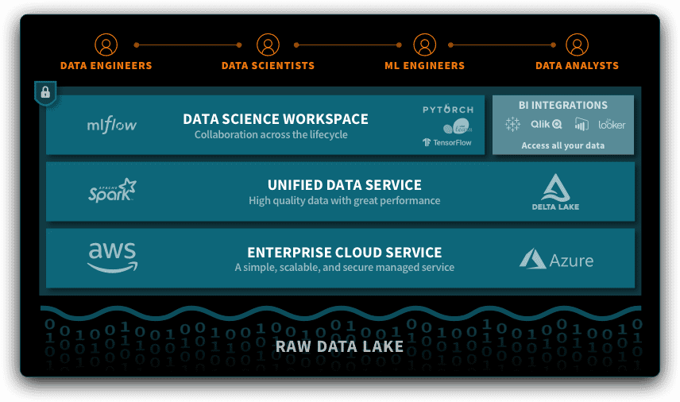
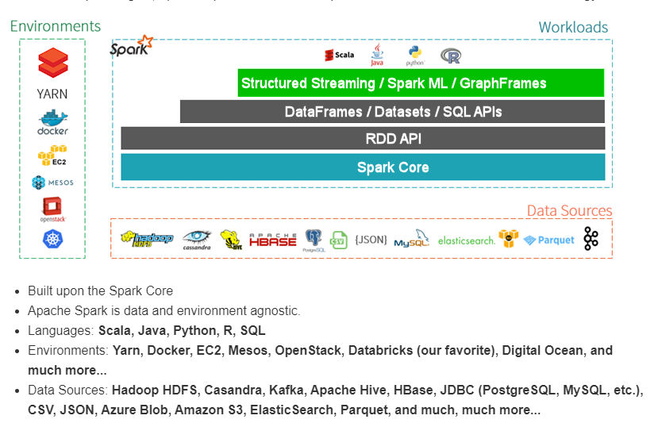
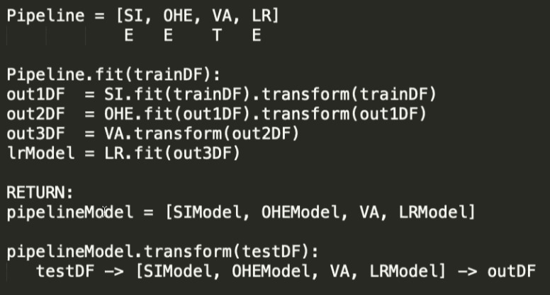

# Introduction to Spark ML

Here you can find the lightweight introduction to Spark ML.

## Agenda

1. [What is Spark and what it's relationship with DataBricks?](#what-is-spark)
2. [A small overview of Spark's architecture.](#sparks-architecture)
3. [Spark's Machine Learning explained](#sparks-machine-learning-explained)
4. [Let's play: set up the Azure DataBricks and create your first cluster.](#azure-setup)
5. [Excersise with Aga: simple Machine Learning's excersise.](#ml-excersise)

# What is Spark?

Apache Spark is an **unified analitics engine**, created for **large-scale data processing**. Unified, because you can run the same method to work on static (csv) files or some real-time data (streams). 

It is **the best for large-scale**, not for small, one compute. **Spark is about processing**, not about the storage.

Main advatages are:
- it is fast
- it is easy to use (Python, Scala, R, Java and SQL)
- it is powerful (without anything to do, you can use SQL, DataFrame, MLib, GraphX and SPark Streaming)
- it runs almost everywhere (Kubernetes, DataBricks, Hadoop and mony others)

Example:
```
textFile = sc.textFile("hdfs://...")

# Creates a DataFrame having a single column named "line"
df = textFile.map(lambda r: Row(r)).toDF(["line"])
errors = df.filter(col("line").like("%ERROR%"))
# Counts all the errors
errors.count()
# Counts errors mentioning MySQL
errors.filter(col("line").like("%MySQL%")).count()
# Fetches the MySQL errors as an array of strings
errors.filter(col("line").like("%MySQL%")).collect()
```

## Operators

There are two types of operators:
- Transformation - is lazy, doesn't loade data into the memory 
  - Example: read, limit, select, drop, distict, dropDuplicates (DataFrames are immutable)
  - Cache acts as transformations but it is muttable
- Action - are not lazy, it fires Spark Job
  - Example: show, could
  - Get some statics, display the data

## Parquet format

Parquet is an file format for storing the data. It is characterized by a columnar format. 

| Row format (csv, json) | Columnar format (parquet, orc) |
|-|-|
| c1,c2/n1,2/n2,3 | c1:1,2,3/nc2:2,3,4 |

While CRUD operations work better with row format, for most of **analytical cases columnar structure is better**.

Parquet features:
- Columnar format
- Binary
- Has internal statistics - divides file for 32 records' blocks and keep some statistics for each block

## DataBricks

The easiest way to enjoy Spark in Azure world is to use the [DataBricks](https://docs.databricks.com/index.html#). DataBricks is an Unified Data Analytics Platform, which consist of a number of usefull libraries and tools for data engineering and data science. Spark is just one of the tools, others are: Data Lake, MLFlow, TensorFlow, PyTorch and many others. 



## Performance tuning

There are many ways how to fix the performance of your application.

Two simplest way is to laverage:
- Convert every data to parquet
- Caching 

For some more, check [Spark's guideline](https://spark.apache.org/docs/latest/tuning.html)

# Spark's architecture

Spark's architecture is layered. Like ogrs. Or onions (but who likes onion...).



First layer is Spark Core. This is Distributed Engine.

Second is RDD (Resilient Distributed Datasets) is first, original API. It is slow (especially Python's API) and not optimized. It is not recomented to use it.

Next layer is so called Modern APIs: DataFrame, Dataset, Spark SQL. DataFrames API is most developed api to interact with sql-like table data. Dataframe API and SQL API are optimized equally. This is achieved by the Catalyst - query optimizer, which analyze the query and optimize it.  

The most top layer is the newest: Spark ML, Structured Streaming (not SparkStreaming), GraphFrames (not GraphX). 

## Cluser structure

Spark gets the best results when it runs on a cluster. 


Cluster contains of **the Driver** and **the Workers**.

Each Cluster has _one driver_, which role is:
- Communicates with user (program)
- Plan the execution with Executors

Cluster can contain _0-N number of workers_. 
Worker is an VM.
Their role is a raw computation.

Each worker has it's own **executor**. 
It is a process launched for an application on a worker node, that runs tasks and keeps data in memory or disk storage across them. 
Each application has its own executors.
In DataBricks, one worker has one executor. 

There are two layers of parallelization:
1) how many executors do you have 
2) how many cores/slot have each worker (each core runs one task)


# Spark's Machine Learning explained

Sparks' ML is pretty nicely unified. It has 4 Filars:

1. Transformers
  - To run the transformation, call transform() method
  - Transformer analyses only on one row
  - Examples:
     - MLModel
     - VectorAssembler: `Col value" => ["col values"]`
     - IndexToString
     - Pipeline

2. Estimator
  - To run the estimation (eg. train the model), call fit() method
  - Analyzes whole DF
  - Examples:
     - ML algorithms
     - StringIndexer `Cat => int`
     - OneHotEncoderEstimator
		
3. Pipeline
  - Is a special type of estimator
  - Consist of multiple stages
  - You can export it (save()) and load back (load()) as well
  - Example: 

	
4.  Evaluators  
  - To run the evaluation, call the evaluate() method
  - Most of them are placed in Pyspark.ml.evaluation module
  - Examples:
     - RegressionEvaluator
     - BinaryClassyficationEvaluator
     - MultiClassClasifficationEvaluator
     - ClusteringEvaluator

# Azure setup

## Azure DataBricks setup 

Before we will start with our ML excersise, we need to set up environments for it. Follow thos steps:

0. Create a resource group where you will keep all excersise-related services.
1. Create a DataBricks service within your VS subscription:


2. After resource will be deployed, launch the Workspace:

3. To use the DataBricks you need to create a cluster. First, go to the Clusters:

and click "Create Cluster":

4. Set up the cluster with following settings:


Creation will take some longer time.

## Azure Storage setup

Another service needed for te excersise is Azure Storage, where we will keep the data.

1. In your resource group, add Azure Storage service:


2. Create a Blob Container where you will keep your data:


3. Download data from [Kaggle](https://www.kaggle.com/c/titanic/data) and upload it into your container.

# ML excersise

Our excersise will be solve known ML problem: predict who will survive the Titanic catastrophy. More about the problem you can found on [Kaggle](https://www.kaggle.com/c/titanic/overview).

What we will do?

- Load the data.
- Handle the null values: mean, average.
- Combine columns: FamilyMembers, IsAlone, FarePerPerson.
- Removal of null values.
- Categorical values
- OneHotEncoding for categorical features.
- Check the correlation between features and label. 
- Use Linear Regression to learn the model.
- Evaluate the model.
- Apply pipeline to control learning.

### Load the data

There are few of ways to load the data from Azure Blob. Simplest one is to connect the blob container:
```
spark.conf.set(
  "fs.azure.sas.<container-name>.<storage-account-name>.blob.core.windows.net",
  "<complete-query-string-of-sas-for-the-container>")
```
and then read file ```data = spark.read.csv("wasbs://<container-name>@<storage-account-name>.blob.core.windows.net/<file-name>")```

Other is to mount the container as a disk:

```
dbutils.fs.mount(
  source = "wasbs://<container-name>@<storage-account-name>.blob.core.windows.net",
  mount_point = "/mnt/titanic_data",
  extra_configs = {"<conf-key>":dbutils.secrets.get(scope = "<scope-name>", key = "<key-name>")})
```
where:
- <mount-name> is a DBFS path representing where the Blob storage container or a folder inside the container (specified in source) will be mounted in DBFS.
- <conf-key> can be either fs.azure.account.key.<storage-account-name>.blob.core.windows.net or fs.azure.sas.<container-name>.<storage-account-name>.blob.core.windows.net
- dbutils.secrets.get(scope = "<scope-name>", key = "<key-name>") gets the key that has been stored as a secret in a secret scope.
	
Then you can read file: ```train_data = spark.read.csv("/mnt/<mount-name>/train")```

### Split to train and test data

For trainig purposes it is good to split train dataset to two: actual train and test dataset. We can do it using statetement ```train_df, test_df = data.randomSplit([0.9, 0.1], seed=42)```

### Data Cleansing
#### Handle the null values: mean, average.

To see how many null values are per each column run:
```
from pyspark.sql.functions import isnull, when, count, col

train_df.select([count(when(isnull(c), c)).alias(c) for c in train_df.columns]).show()
```

As you all know there are multiple ways how to handle the null values, both general ways (eg. replace with some value) or manual. Spark provides class called `Imputer` which helps you to impute missing values. 

Question: will `Imputer` be transformer or estimator?

But our case we will handle Age manually, rest will be omitted.
```
def handle_missing_age(df: DataFrame) -> DataFrame:
    _df = df
    _df = _df.withColumn('Age', 
           F.when((F.isnull(_df['Age'])) & (_df['Initial'] == 'Mr') , 33 )\
            .otherwise(F.when((F.isnull(_df['Age'])) 
                              & (_df['Initial'] == 'Mrs') , 36)\
            .otherwise(F.when((F.isnull(_df['Age'])) 
                              & (_df['Initial'] == 'Master') , 5)\
            .otherwise(F.when((F.isnull(_df['Age'])) 
                              & (_df['Initial'] == 'Miss') , 22)\
            .otherwise(F.when((F.isnull(_df['Age'])) 
                              & (_df['Initial'] == 'Other') , 46)\
            .otherwise(_df['Age']) )))))
    return _df
```

#### Combine columns: FamilyMembers, IsAlone, FarePerPerson

Firstly, let's add new column, which will contain an information about number of members in passengers family:
```
def create_family_size(df: DataFrame) -> DataFrame:
  _df = df.withColumn('FamilySize', df['Parch'] + df['SibSp'] + 1 )
  return _df
```

Then, define if passenger travels alone:
```
def create_is_alone(df: DataFrame) -> DataFrame:
  _df = df.withColumn('IsAlone', F.when(df['FamilySize'] > 1, 0).otherwise(1))
  return _df
```

After that, calculate fare per person:
```
def create_fare_per_person(df: DataFrame) -> DataFrame:  
  _df = df.withColumn('FarePerPerson', df['Fare'] /df['FamilySize'])
  return _df
```

Lastly, let's create a new column which will inform us about the initial of the passenger:
```
def evaluate_initials(df: DataFrame) -> DataFrame:
  dizip_initials = {k:v for k,v in (zip(['Mlle','Mme','Ms','Dr', 'Major','Lady','Countess', 'Jonkheer','Col','Rev', 'Capt','Sir','Don'], ['Miss','Miss','Miss', 'Mr','Mr','Mrs','Mrs', 'Other','Other','Other', 'Mr','Mr','Mr']))}
  _df = df.withColumn('Initial',  F.regexp_extract( df['Name'], ('([A-Za-z]+)\.'),1 ) )
  _df = _df.replace(dizip_initials,1,'Initial')
  return _df
```

Let's apply all on our data:
```
train_df = handle_missing_age(evaluate_initials(create_fare_per_person(create_is_alone(create_family_size(train_df)))))
```

#### Removal of null values

For some cases you might want to remove the rows which has null values for some data:
```
def drop_rows_with_null(df: DataFrame, col) -> DataFrame:
  _df = df = df.filter(df[col].isNotNull())
  return _df
```

We want to get rid of empyt value for Embarked, since it's just two rows:
```
train_df = drop_rows_with_null(train_df, 'Embarked')
```

#### Categorical values

Most of algorithms works better, or even can handle only the numerical values. There are number of ways to transform categorical values into numbers. The simplest one given by Spark ML is probably `StringIndexer` class. Usage is very simple:

```
def change_to_index(df: DataFrame, col) -> DataFrame:
  indexer = StringIndexer(inputCol=col, outputCol='{0}_indexed'.format(col))
  _df = indexer.fit(df).transform(df)
  return _df
```

As it was metined before, `StringIndexer` is an estimator, because it needs to analyse whole set of data.

#### OneHotEncoding for categorical features

When it comes to working better and quicker with data, OneHotEncoding is also a good choice. So after transforming data into number, we can also transform it into the OneHot form:

```
def change_to_one_hot_encoded(df: DataFrame, cols) -> DataFrame:
  for col in cols:
    df = change_to_index(df, col)
  col_indexed = ['{0}_indexed'.format(col) for col in cols]
  col_encoded = ['{0}_encoded'.format(col) for col in cols]
  encoder = OneHotEncoderEstimator(inputCols=col_indexed, outputCols=col_encoded)
  _df = encoder.fit(df).transform(df)
  return _df
```

And applying: ```train_df = change_to_one_hot_encoded(train_df, ['Sex', 'Initial', 'Embarked'])```

### Use Linear Regression to learn the model

[Spark ML](https://spark.apache.org/docs/latest/ml-classification-regression.html) contains a big number of machine learning's algorithms' implementations. I've chosen probably the simplest one to show, but you can easly change it and use any other. 

Most of the algorithms works on vectors. We need to translate our features into vectors then:
```
cols = [c for c in train_df.columns if c != 'Survived']
assembler = VectorAssembler(inputCols=cols, outputCol="Features")
vec_train_df = assembler.transform(train_df)
```
Then it's time to learn our model:
```
lr = LinearRegression(featuresCol="Features", labelCol="Survived")
model = lr.fit(vec_train_df)
```

### Evaluate the model

To evaluate a model, start with transforming test DataFrame (do not forget to run data cleansing on test_df!):
```
vec_test_df = assembler.transform(test_df)
pred_df = model.transform(vec_test_df)
```
By default, transformation will add a column named `prediction` with predicted value. Let's evaluate how good it has predicted a value:
```
regression_evaluator = RegressionEvaluator(predictionCol="prediction", labelCol="Survived", metricName="rmse")

rmse = regression_evaluator.evaluate(pred_df)
print(f"RMSE is {rmse}")
```

### Apply pipeline to control learning

Spark ML has one great feature called `Pipeline`. It helps setting up, manupulating and running whole pipeline. Pipeline is specific type of estimator, so you can only run `fit` on it.

```
stages = []
pipeline = Pipeline(stages=stages)
pipeline_model = pipeline.fit(train_df)
```
Also it allows you to save your model in DataBricks.

```
pipeline_path = userhome + "/machine-learning-p/lr_pipeline_model"
pipeline_model.write().overwrite().save(pipeline_path)
```

You can create a custom transformer/estimator and use it as a stage. To do it (and has ability to save model and load), you need to implement as follow:

- inherit from classes: `Transformer` or `Estimator`, `DefaultParamsReadable`, `DefaultParamsWritable`
- implement constructor:
```
@keyword_only
  def __init__(self):
    super(ClassName, self).__init__()
```
- implement wanted method: `_transform` or `_fit`
- add class to running module:
```
m = __import__("__main__")
setattr(m, 'ClassName', ClassName)
```
- in case of some input param also:
   - add property of type param, eg:
   ```
   col = Param(Params._dummy(), "col", "column", typeConverter=TypeConverters.toString)
   ```
   - add getter and setter method, eg:
   ```
   def setCol(self, value):
      return self._set(col=value)

   def getCol(self):
      return self.getOrDefault(self.col)
   ```
   - remeber of using getter method when you access property in `_transform` method
 
 
 Example of custom transformer:
 ```
 class DropRowsWithNullTransformer(Transformer, DefaultParamsReadable, DefaultParamsWritable):
  def __init__(self): 
    super(DropRowsWithNullTransformer, self).__init__()
  
  col = Param(Params._dummy(), "col", "column", typeConverter=TypeConverters.toString)

  def setCol(self, value):
      return self._set(col=value)

  def getCol(self):
      return self.getOrDefault(self.col)

  def _transform(self, df: DataFrame) -> DataFrame:
    _df = df = df.filter(df[self.getCol()].isNotNull())
    return _df

setattr(m, 'DropRowsWithNullTransformer', DropRowsWithNullTransformer)
```
 
and usage:
```
drop_rows_with_null_trans = DropRowsWithNullTransformer()
drop_rows_with_null_trans.setCol('Embarked')
 ```
